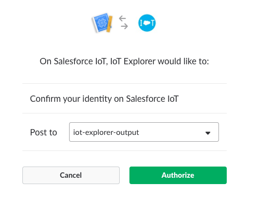
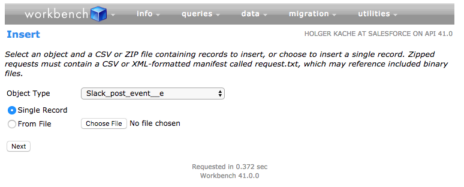

# Slack 4 IoT Package

The package offers an integration for Salesforce Platform Events with Slack. With the package you can send messages to any Slack channel directly from a custom platform event. You can freely construct the platform event message and format it with the familiar Slack markdown options.

With the Slack integration you can integrate your IoT orchestrations with Slack. In the orchestration output action, you can emit a platform event to send alerts to your Slack channel, create debug output, or even consume your IoT events with downstream applications. 

# Intended Audience

The package is intended for any Salesforce platform developer but with a special focus on Salesforce IoT. While platform events can be emitted from many Salesforce components, Salesforce IoT supports them for both, input and output. 

The setup  requires access to a Slack account with admin privileges.

# Contributors

The package is related to Jonathan Jenkins’ package for Twilio integration at: [https://git.soma.salesforce.com/jonathan-jenkins/pe-to-twilio](https://git.soma.salesforce.com/jonathan-jenkins/pe-to-twilio)

Especially the persistence of authentication details in custom objects was directly replicated from the above package.

# Story

Slack is the fastest growing cloud-based team collaboration platform today. It is based on real-time messaging technology and features an open API for easy integration with external platforms. 

Thanks to that open API approach, Slack has become more than a collaboration platform for humans. It is a platform for real-time bots and agents to communicate and even integrate. All major productivity tools including Splunk, Datadog, Jenkins, Docker today have bots communicating directly with Slack. In a true publisher-subscriber fashion, some agents publish messages to a Slack channel, while other agents subscribe to messages on a channel.

IoT Explorer, too,  is based on a real-time messaging platform. Messages are emitted through Platform Events and processed by IoT Explorer rules inside orchestrations. The result of a these rules can be emitted again as a Platform Event or a Salesforce record today.

WIth this package we can emit messages directly to Slack and open IoT Explorer for real-time integration with external systems. In the most simple scenario described here, we have a human read the output action in a formatted text. In a much bigger context, however, these messages could be consumed by any subscriber to the Slack channel.

# Solution

## Setup Process

Before you can emit your first message, you have to do 2 things as admin:

1 - for Slack, register a new app with a webhook for incoming traffic

2 - for Salesforce, allow the Slack input webhook to be reached from Salesforce and configure your org with the webhook details

**1 Slack**

To execute these steps you have to have admin privileges on the channel. If you don’t have those for a given channel, you can either request or simply create a new channel. The owner of a channel will have admin privileges.

To get started, either use the find the "Add an app" menu item ...


… or navigate directly to [https://api.slack.com/apps](https://api.slack.com/apps)


* Create an app with a name (e.g. "IoT Explorer") and select the right workspace

* Click "Activate Incoming Webhooks" first and then “Add New Webhook to Workspace”

* Authorize the new webhook with existing channel

* Copy the webhook URL (you will need that in the next step with Salesforce configuration)

**2 Salesforce**

The first thing to do in Salesforce is allow for outgoing traffic to [https://hooks.slack.com](https://hooks.slack.com). This is a security configuration and requires appropriate privileges on the org you are trying to configure. IoT Explorer today requires admin privileges, so chances are you already have admin rights to make this change anyways.

From Setup → Security → Remote Site Settings

* Add the copied webhook URL (with or without the actual path) as new remote site


Finally you are going to create an instance of a custom object "Slack_PE_Settings__c" to populate the Slack webhook URL into.

Open workbench at [https://workbench.developerforce.com/insert.php](https://workbench.developerforce.com/insert.php)

* With data → Insert you can select the "Slack_PE_Settings__c" object

* Use any "Name" to identify the configuration with

* For OwnerId use the Smart Lookup field "Owner.Username"

* The webhook__c is the complete webhook URL (including path) copied from Slack above

## Metadata Config

Besides the "Slack PE Settings" there is one custom object called “Slack Message”. That object has a single field “Text” of type String(255) for the actual Slack message.


To test the Slack integration for IoT orchestrations, we would need some sort of IoT input events to be available to trigger rules and produce output actions. Without an IoT context available, however, we can simulate the output action simply by sending the Platform Event manually.

To do that we can use workbench or any other external REST client (like Postman). Below is the schema for the platform event.

In a real-world IoT situation, we would want orchestrations to emit the "Slack_post_event__e" for us.


 

## Testing

Open workbench again at [https://workbench.developerforce.com/insert.php](https://workbench.developerforce.com/insert.php)

* With data → Insert select the "Slack_post_event__e" event

* Use any "Slack_post_ID__c" to identify the message with

* Leave "ReplayId" blank

* In the "Message__c" field you can post a markdown formatted message, e.g.

> Event *1234* was received by IoT Explorer with message ```Bingo bongo``` from user ID `005B0000003Y9V2IAK` at 2017-10-20 16:10:13Z


Again, in an IoT orchestration this type of message would be constructed with event data and context. Here we only assume the role of an IoT orchestration and emit the platform event manually.

If everything worked as expected, you will see the Slack message appear in your channel:


# Solution Diagram


